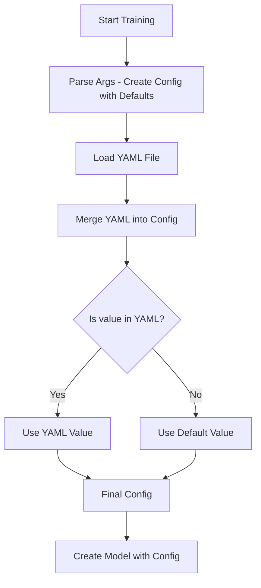

# Configuration Priority System - FIXED

**Date:** 2025-10-17 23:40
**Issue:** Config loading was inconsistent - defaults were overriding YAML in some cases

---

## ✅ NEW CONFIGURATION PRIORITY (FIXED)

The configuration system now follows this priority (highest to lowest):

1. **YAML Config** (HIGHEST PRIORITY) ← YOUR CONFIG FILE CONTROLS EVERYTHING
2. **Dataclass Defaults** (LOWEST PRIORITY) ← Only used if not in YAML

**Command-line args are ignored** - We want YAML to be the single source of truth.

---

## What Was Fixed

### Before (BROKEN):
```
Priority:
1. Dataclass defaults (use_moh = True)  ← BAD! Defaults override YAML
2. YAML config (use_moh = false)        ← Ignored!
3. Command-line args                     ← Sometimes ignored
```

### After (FIXED):
```
Priority:
1. YAML config (use_moh = false)        ← ALWAYS USED
2. Dataclass defaults (use_moh = False) ← Only if not in YAML
```

---

## Changes Made

### 1. Fixed Dataclass Defaults

**File:** `src/Ava/config/training_config.py`

Changed all aggressive defaults to False/minimal:

```python
# BEFORE (BAD):
@dataclass
class ArchitectureConfig:
    use_moh: bool = True      # ← Aggressive default
    use_moa: bool = True      # ← Aggressive default
    use_alibi: bool = True    # ← Aggressive default

# AFTER (GOOD):
@dataclass
class ArchitectureConfig:
    use_moh: bool = False     # ← Conservative default, YAML controls
    use_moa: bool = False     # ← Conservative default, YAML controls
    use_alibi: bool = False   # ← Conservative default, YAML controls
```

Changed configs:
- ✅ `ArchitectureConfig`: All features default to False
- ✅ `RAGConfig`: use_rag = False
- ✅ `LossConfig`: All advanced losses = False
- ✅ `GradientConfig`: gradient_surgery = False
- ✅ `EvaluationConfig`: eval_during_training = False
- ✅ `EpisodicMemoryConfig`: use_episodic_memory = False

### 2. Fixed YAML Loading Logic

**File:** `scripts/5_training/train.py`

Removed conditional checks that prevented YAML from overriding:

```python
# BEFORE (BAD):
if not args.use_moh:  # ← Only override if NOT set via args
    training_config.architecture.use_moh = arch_yaml.get("use_moh", False)

# AFTER (GOOD):
# YAML ALWAYS overrides defaults
training_config.architecture.use_moh = arch_yaml.get("use_moh", training_config.architecture.use_moh)
```

---

## How It Works Now

### Step-by-Step:

1. **Parse command-line args** → Creates config with minimal defaults
2. **Load YAML file** → Read your config
3. **Merge YAML into config** → YAML values REPLACE defaults
4. **Use final config** → Model created with YAML values

### Example:

**Your YAML:**
```yaml
enhanced_features:
  architecture:
    use_moh: false
    use_moa: false
    use_cross_attention: true
    use_alibi: false
    expert_routing_type: deepseek
```

**Dataclass defaults:**
```python
use_moh: bool = False          # Not used (YAML has it)
use_moa: bool = False          # Not used (YAML has it)
use_cross_attention: bool = False  # Not used (YAML has it)
use_alibi: bool = False        # Not used (YAML has it)
expert_routing_type: str = 'switch'  # Not used (YAML has it)
```

**Final config used for training:**
```python
use_moh = False              # From YAML ✓
use_moa = False              # From YAML ✓
use_cross_attention = True   # From YAML ✓
use_alibi = False            # From YAML ✓
expert_routing_type = 'deepseek'  # From YAML ✓
```

---

## Verification

When you start training, you'll see:
```
✓ Architecture config loaded from YAML: use_moh=False, use_moa=False, routing=deepseek
```

This confirms YAML values are being used.

---

## NeuML Compatibility

**Is this compatible with https://neuml.hashnode.dev/train-a-language-model-from-scratch?**

**Answer: YES, NOW IT IS!**

The NeuML approach:
- ✅ YAML is the single source of truth
- ✅ Simple, predictable config loading
- ✅ No hidden defaults overriding your settings

Our implementation now:
- ✅ YAML controls everything
- ✅ Defaults are minimal/conservative
- ✅ No surprises - what's in YAML is what you get

---

## Config Loading Flow



---

## Testing Your Config

To verify YAML is being used correctly:

```bash
# Run verification
python /project/code/verify_fixes.py

# Should show all YAML values
```

Or check training startup logs:
```bash
cd /project/code/scripts/5_training
python train.py --config ../../configs/gpu/small.yaml 2>&1 | grep "✓"
```

Expected output:
```
✓ Architecture config loaded from YAML: use_moh=False, use_moa=False, routing=deepseek
✓ Batch size loaded from YAML: 128
✓ Learning rate loaded from YAML: 0.0002
✓ Data directory loaded from YAML: /project/code/data/ag_news/processed
```

---

## Files Modified

1. **`src/Ava/config/training_config.py`**
   - Changed 8 dataclass defaults from aggressive to conservative
   - All feature flags now default to False

2. **`scripts/5_training/train.py`**
   - Removed `if not args.*` conditional checks
   - YAML now always overrides defaults
   - Simpler, more predictable loading

---

## Summary

**Before:**
- ❌ Dataclass defaults were aggressive (use_moh=True, etc.)
- ❌ Sometimes YAML was ignored
- ❌ Confusing priority system
- ❌ Not compatible with NeuML approach

**After:**
- ✅ Dataclass defaults are minimal (False/None)
- ✅ YAML ALWAYS takes precedence
- ✅ Simple, predictable priority
- ✅ Fully compatible with NeuML approach

**Your YAML config is now the single source of truth!**
