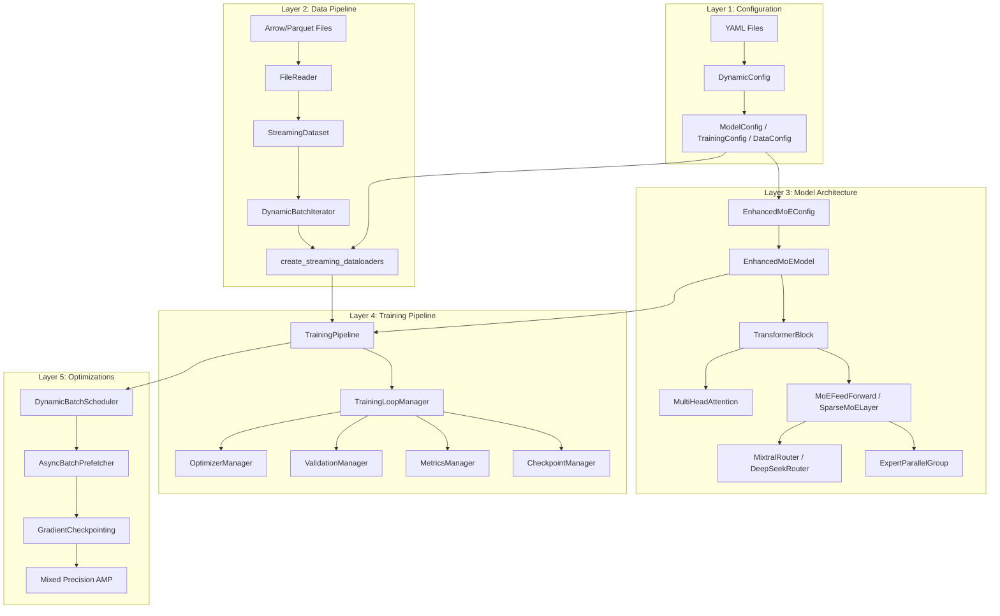
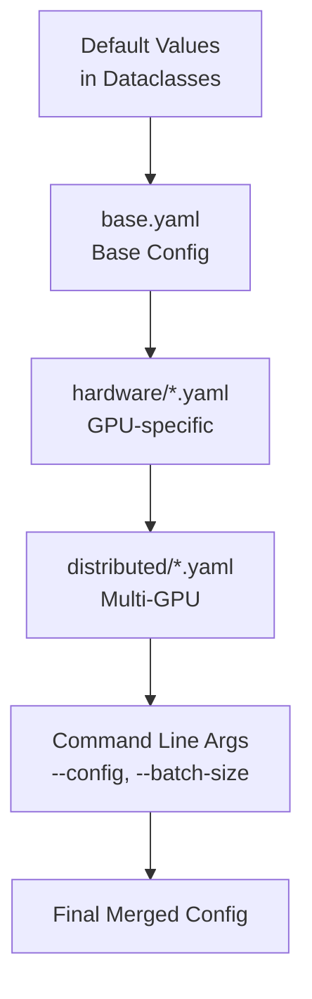
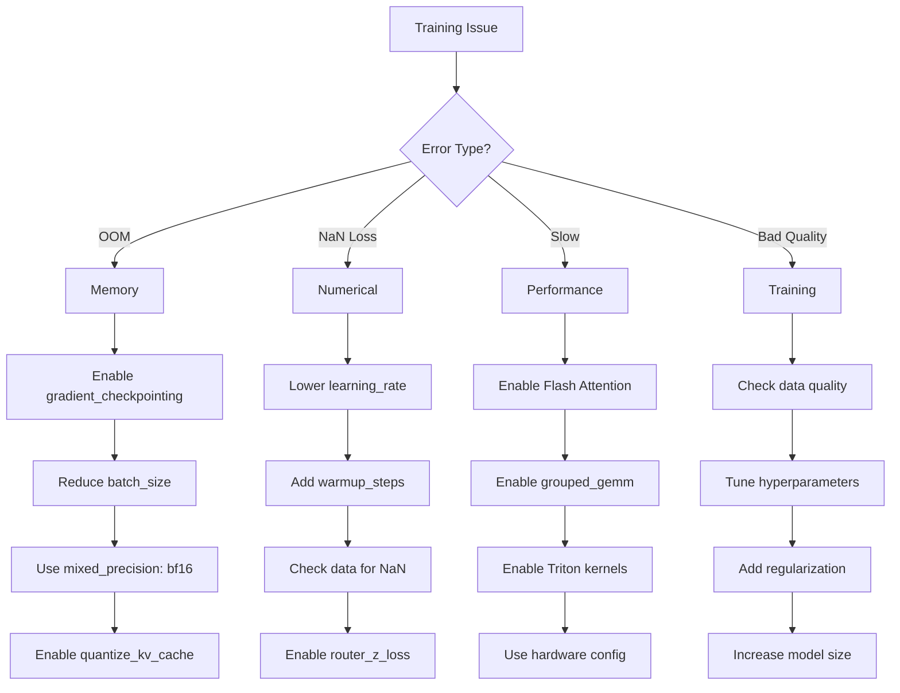

# Ava Framework API Reference

Comprehensive API reference and developer guide for the Ava LLM training framework with Mixture of Experts (MoE++) architecture.

**Version**: 1.0 | **Package**: `ava` | **Python**: 3.8+

---

## Table of Contents

- [1. Quick Start](#1-quick-start)
  - [Installation](#installation)
  - [Minimal Training Example](#minimal-training-example)
  - [Import Cheat Sheet](#import-cheat-sheet)
- [2. Architecture Overview](#2-architecture-overview)
  - [System Architecture](#system-architecture)
  - [Module Dependency Graph](#module-dependency-graph)
  - [Training Data Flow](#training-data-flow)
- [3. Module Reference](#3-module-reference)
  - [3.1 ava.models](#31-avamodels)
  - [3.2 ava.nn](#32-avann)
  - [3.3 ava.config](#33-avaconfig)
  - [3.4 ava.data](#34-avadata)
  - [3.5 ava.training](#35-avatraining)
  - [3.6 ava.optimizations](#36-avaoptimizations)
  - [3.7 ava.optim](#37-avaoptim)
  - [3.8 ava.cuda](#38-avacuda)
  - [3.9 ava.kernels](#39-avakernels)
  - [3.10 ava.strategies](#310-avastrategies)
  - [3.11 ava.eval](#311-avaeval)
  - [3.12 ava.core](#312-avacore)
- [4. Configuration Reference](#4-configuration-reference)
  - [YAML Schema](#yaml-schema)
  - [Configuration Hierarchy](#configuration-hierarchy)
  - [Parameter Quick Reference](#parameter-quick-reference)
- [5. Performance Benchmarks](#5-performance-benchmarks)
- [6. Cross-Reference Index](#6-cross-reference-index)
- [7. Troubleshooting](#7-troubleshooting)
- [8. Glossary](#8-glossary)

---

## 1. Quick Start

### Installation

```bash
# Install dependencies
pip install -r requirements.txt

# Verify installation
python code/scripts/check_dependencies.py
```

### Minimal Training Example

```python
from ava.models import EnhancedMoEModel, EnhancedMoEConfig
from ava.data import create_streaming_dataloaders
from ava.config import DynamicConfig
import torch

# 1. Load configuration
config = DynamicConfig({
    'model': {'vocab_size': 50680, 'hidden_size': 1024, 'num_layers': 6,
              'num_attention_heads': 16, 'num_experts': 8},
    'training': {'batch_size': 32, 'learning_rate': 0.0006}
})

# 2. Create model
model_config = EnhancedMoEConfig(
    vocab_size=config.model.vocab_size,
    hidden_size=config.model.hidden_size,
    num_layers=config.model.num_layers,
    num_attention_heads=config.model.num_attention_heads,
    num_experts=config.model.num_experts,
)
model = EnhancedMoEModel(model_config).cuda()

# 3. Create dataloaders
train_loader, val_loader = create_streaming_dataloaders(
    data_dir='/path/to/data',
    batch_size=config.training.batch_size,
    max_length=512,
)

# 4. Train
optimizer = torch.optim.AdamW(model.parameters(), lr=config.training.learning_rate)
for batch in train_loader:
    outputs = model(batch['input_ids'].cuda(), labels=batch['labels'].cuda())
    outputs['loss'].backward()
    optimizer.step()
    optimizer.zero_grad()
```

### Import Cheat Sheet

| Need | Import |
|------|--------|
| **Model** | `from ava.models import EnhancedMoEModel, EnhancedMoEConfig, OptimizedMoETransformer, OptimizedMoEConfig` |
| **MoE Layer** | `from ava.models import SparseMoELayer` |
| **Routers** | `from ava.nn import MixtralRouter, DeepSeekRouter, UnifiedMoERouter` |
| **Experts** | `from ava.nn import ExpertParallelGroup, HighPerformanceExpert, SharedExpertLayer` |
| **Config** | `from ava.config import DynamicConfig, ModelConfig, TrainingConfig, DataConfig` |
| **Data Loading** | `from ava.data import create_streaming_dataloaders, StreamingDataset` |
| **Training** | `from ava.training import TrainingLoopManager, TrainingContext, TrainingPipeline` |
| **Optimizations** | `from ava.optimizations import DynamicBatchScheduler, AsyncBatchPrefetcher` |
| **LR Schedule** | `from ava.optim import AdaptiveLearningRateManager` |
| **Evaluation** | `from ava.eval import CoherenceMeasurer, CoherenceConfig` |
| **Utilities** | `from ava.core import get_project_root, setup_colored_logging` |

---

## 2. Architecture Overview

### System Architecture



### Module Dependency Graph

```
ava/
├── config/          ← Core configuration (no dependencies)
│   └── constants.py, training_config.py, yaml_loader.py
│
├── core/            ← Utilities (depends: config)
│   └── paths.py, logging.py, activations.py, mixed_precision.py
│
├── kernels/         ← Triton kernels (depends: none)
│   └── moe.py, activations.py, fused_experts.py
│
├── nn/              ← Neural layers (depends: core, kernels)
│   └── experts.py, routing.py
│
├── models/          ← Model architectures (depends: nn)
│   └── moe.py, moe_layer.py
│
├── data/            ← Data loading (depends: config, core)
│   └── streaming.py, bucketing.py, factory.py
│
├── optimizations/   ← Training optimizations (depends: config)
│   └── dynamic_batching.py, checkpointing.py, prefetch.py
│
├── optim/           ← Optimizer utilities (depends: config)
│   └── lr_managers.py
│
├── cuda/            ← CUDA utilities (depends: none)
│   └── metrics.py, streams.py, profiler.py
│
├── training/        ← Training loop (depends: all above)
│   └── loop.py, pipeline.py, context.py, managers...
│
├── strategies/      ← Training strategies (depends: training)
│   └── progressive.py
│
└── eval/            ← Evaluation (depends: models)
    └── coherence.py
```

### Training Data Flow

```mermaid
sequenceDiagram
    participant Config as YAML Config
    participant Data as DataLoader
    participant Pre as Prefetcher
    participant Model as MoE Model
    participant Router as Router
    participant Experts as Experts
    participant Opt as Optimizer
    participant Ckpt as Checkpoint

    Config->>Data: Load configuration
    Config->>Model: Build model

    loop Training Step
        Data->>Pre: Load batch
        Pre->>Model: GPU batch (async)
        Model->>Router: Hidden states
        Router->>Router: Top-K selection
        Router->>Experts: Route tokens
        Experts->>Model: Expert outputs
        Model->>Opt: Backward + step

        alt Checkpoint interval
            Opt->>Ckpt: Async save
        end
    end
```

---

## 3. Module Reference

### 3.1 ava.models

Model architectures for MoE++ transformers.

**File**: `code/src/ava/models/moe.py`, `moe_layer.py`

#### EnhancedMoEConfig

Configuration for the standard MoE transformer.

```python
@dataclass
class EnhancedMoEConfig:
    """
    Configuration for EnhancedMoEModel.

    Use for development, testing, and single-GPU training.
    For production with performance optimizations, use OptimizedMoEConfig.

    Args:
        vocab_size (int): Vocabulary size. Default: 50257
        hidden_size (int): Hidden dimension. Default: 768
        num_layers (int): Number of transformer layers. Default: 12
        num_attention_heads (int): Number of attention heads. Default: 12
        intermediate_size (int): FFN intermediate dimension. Default: 3072
        max_position_embeddings (int): Maximum sequence length. Default: 2048
        num_experts (int): Number of MoE experts. Default: 8
        num_experts_per_token (int): Experts activated per token (K). Default: 2
        expert_capacity_factor (float): Capacity multiplier. Default: 1.25
        router_type (str): Routing strategy ('switch', 'deepseek'). Default: 'switch'
        router_aux_loss_coef (float): Auxiliary loss weight. Default: 0.01
        use_flash_attention (bool): Enable Flash Attention. Default: False
        gradient_checkpointing (bool): Enable checkpointing. Default: False
        use_grouped_gemm (bool): Enable grouped GEMM. Default: False
        use_triton_kernels (bool): Enable Triton kernels. Default: False

    Example:
        >>> config = EnhancedMoEConfig(
        ...     vocab_size=50680,
        ...     hidden_size=1024,
        ...     num_layers=16,
        ...     num_experts=8,
        ...     num_experts_per_token=2,
        ... )
    """
```

#### EnhancedMoEModel

Standard MoE transformer model.

```python
class EnhancedMoEModel(nn.Module):
    """
    Enhanced Mixture of Experts Transformer Model.

    Features:
        - Switch/DeepSeek routing strategies
        - RoPE positional embeddings
        - Flash Attention support
        - Gradient checkpointing
        - KV cache for generation
        - Multiple auxiliary losses

    Args:
        config (EnhancedMoEConfig): Model configuration

    Example:
        >>> config = EnhancedMoEConfig(num_experts=8, hidden_size=1024)
        >>> model = EnhancedMoEModel(config)
        >>> inputs = torch.randint(0, 50257, (2, 128))
        >>> outputs = model(inputs, labels=inputs)
        >>> loss = outputs['loss']
    """

    def forward(
        self,
        input_ids: torch.Tensor,
        attention_mask: Optional[torch.Tensor] = None,
        labels: Optional[torch.Tensor] = None,
        past_key_values: Optional[List[tuple]] = None,
        use_cache: bool = False,
        return_dict: bool = True,
    ) -> Dict[str, Any]:
        """
        Forward pass through the model.

        Args:
            input_ids: Token IDs [batch_size, seq_len]
            attention_mask: Attention mask [batch_size, seq_len]
            labels: Target labels for loss [batch_size, seq_len]
            past_key_values: KV cache for generation
            use_cache: Enable KV caching
            return_dict: Return dict vs tuple

        Returns:
            Dict with 'loss', 'logits', 'hidden_states', 'aux_info', 'past_key_values'
        """

    def generate(
        self,
        input_ids: torch.Tensor,
        max_length: int = 100,
        temperature: float = 1.0,
        top_p: float = 0.9,
        top_k: Optional[int] = None,
        repetition_penalty: float = 1.0,
        no_repeat_ngram_size: int = 0,
        do_sample: bool = True,
        use_cache: bool = True,
    ) -> torch.Tensor:
        """
        Autoregressive text generation with KV caching (20-50x speedup).

        Args:
            input_ids: Prompt token IDs [batch_size, prompt_len]
            max_length: Maximum total length (including prompt)
            temperature: Sampling temperature (higher = more random)
            top_p: Nucleus sampling threshold
            top_k: Top-k filtering (None = disabled)
            repetition_penalty: Penalty for repeating tokens (>1.0 discourages)
            no_repeat_ngram_size: Block n-gram repetitions
            do_sample: Sample (True) vs greedy (False)
            use_cache: Enable KV caching for speedup

        Returns:
            Generated token IDs [batch_size, generated_len]
        """

    def clear_caches(self) -> None:
        """Clear internal caches (causal mask, RoPE) to free VRAM."""
```

**Key Methods:**

| Method | Parameters | Returns | Description |
|--------|------------|---------|-------------|
| `forward` | `input_ids, attention_mask, labels, ...` | `Dict` | Forward pass with optional loss |
| `generate` | `input_ids, max_length, temperature, ...` | `Tensor` | Autoregressive generation |
| `clear_caches` | None | `None` | Free cached tensors |
| `get_input_embeddings` | None | `nn.Embedding` | Get token embeddings |
| `set_input_embeddings` | `value` | `None` | Set token embeddings |

#### OptimizedMoEConfig

Configuration for production MoE with all optimizations.

```python
@dataclass
class OptimizedMoEConfig:
    """
    Configuration for OptimizedMoETransformer with production optimizations.

    Key differences from EnhancedMoEConfig:
        - Grouped GEMM enabled by default (5-10x expert speedup)
        - Triton kernels enabled by default
        - torch.compile support
        - Expert parallelism for distributed training

    Args:
        vocab_size (int): Vocabulary size. Default: 32000
        hidden_size (int): Hidden dimension. Default: 4096
        num_layers (int): Number of layers. Default: 32
        num_experts (int): Number of experts. Default: 32
        num_experts_per_token (int): Top-K. Default: 2
        router_type (str): 'mixtral' or 'deepseek'. Default: 'mixtral'
        use_grouped_gemm (bool): Enable grouped GEMM. Default: True
        use_triton_kernels (bool): Enable Triton. Default: True
        use_torch_compile (bool): Enable torch.compile. Default: True
        gradient_checkpointing (bool): Enable checkpointing. Default: False
        use_shared_expert (bool): DeepSeek shared expert. Default: False
    """
```

#### SparseMoELayer

Drop-in FFN replacement with sparse expert routing.

```python
class SparseMoELayer(nn.Module):
    """
    Sparse Mixture of Experts layer - drop-in FFN replacement.

    This layer can replace any feedforward network with a mixture of
    expert networks for better parameter efficiency.

    Args:
        hidden_size (int): Input/output dimension
        intermediate_size (int): FFN hidden dimension
        num_experts (int): Number of experts. Default: 8
        num_experts_per_token (int): Top-K selection. Default: 2
        router_type (str): 'mixtral' or 'deepseek'. Default: 'mixtral'
        capacity_factor (float): Expert capacity multiplier. Default: 1.25
        activation (str): 'swiglu', 'geglu', 'gelu'. Default: 'swiglu'
        use_grouped_gemm (bool): Enable grouped GEMM. Default: True
        use_triton_kernels (bool): Enable Triton kernels. Default: True
        router_z_loss_coef (float): Z-loss coefficient. Default: 0.001
        load_balance_loss_coef (float): Load balance loss. Default: 0.01
        diversity_loss_coef (float): Diversity loss. Default: 0.001
        gradient_checkpointing (bool): Checkpoint expert computation. Default: False

    Example:
        >>> moe = SparseMoELayer(
        ...     hidden_size=4096,
        ...     intermediate_size=14336,
        ...     num_experts=32,
        ...     num_experts_per_token=2,
        ... )
        >>> x = torch.randn(8, 128, 4096)
        >>> output, aux_loss, metrics = moe(x, training=True)
    """

    def forward(
        self,
        hidden_states: torch.Tensor,
        training: bool = True,
    ) -> Tuple[torch.Tensor, torch.Tensor, Dict[str, Any]]:
        """
        Forward pass through Sparse MoE layer.

        Args:
            hidden_states: Input [batch_size, seq_len, hidden_size]
            training: Whether in training mode

        Returns:
            - output: Layer output [batch_size, seq_len, hidden_size]
            - aux_loss: Total auxiliary loss (scalar)
            - metrics: Dictionary of routing metrics
        """
```

---

### 3.2 ava.nn

Neural network layers for MoE architecture.

**File**: `code/src/ava/nn/routing.py`, `experts.py`

#### UnifiedMoERouter

Base router class with common optimizations.

```python
class UnifiedMoERouter(nn.Module):
    """
    Base router class with auxiliary losses and metrics.

    Provides:
        - Router z-loss: Prevents unbounded router logits
        - Load balancing loss: Uniform expert utilization
        - Capacity factors: Token dropping for overloaded experts
        - Metrics: Utilization, entropy, balance scores

    Args:
        hidden_size (int): Input dimension
        num_experts (int): Number of experts
        num_selected_experts (int): Top-K selection. Default: 2
        capacity_factor (float): Expert capacity multiplier. Default: 1.25
        router_z_loss_coef (float): Z-loss coefficient. Default: 0.001
        load_balance_loss_coef (float): Load balance coefficient. Default: 0.01
        router_jitter_noise (float): Exploration noise. Default: 0.0
        use_triton_kernels (bool): Enable Triton fused kernels. Default: True
    """
```

#### MixtralRouter

Mixtral-style top-K router (production-proven).

```python
class MixtralRouter(UnifiedMoERouter):
    """
    Mixtral-style top-K router with learned gating.

    This is the routing strategy used in Mixtral 8x7B - proven
    to work at scale in production.

    Key features:
        - Top-K selection (K=2 typically)
        - Softmax normalization over selected experts
        - Load balancing via auxiliary loss
        - Router z-loss for stability
        - Optional Triton fused kernels (15-25% speedup)

    Args:
        Same as UnifiedMoERouter

    Example:
        >>> router = MixtralRouter(4096, 32, num_selected_experts=2)
        >>> x = torch.randn(128, 4096)
        >>> indices, weights, aux_loss, metrics = router(x, training=True)
        >>> # indices: [128, 2], weights: [128, 2]
    """

    def forward(
        self,
        hidden_states: torch.Tensor,
        training: bool = True,
    ) -> Tuple[torch.Tensor, torch.Tensor, torch.Tensor, Dict[str, Any]]:
        """
        Forward pass through Mixtral router.

        Args:
            hidden_states: [num_tokens, hidden_size]
            training: Whether in training mode

        Returns:
            - expert_indices: [num_tokens, k]
            - expert_weights: [num_tokens, k] (normalized)
            - aux_loss: Scalar auxiliary loss
            - metrics: Routing metrics dictionary
        """
```

#### DeepSeekRouter

DeepSeek-style router with shared + routed experts.

```python
class DeepSeekRouter(UnifiedMoERouter):
    """
    DeepSeek-style router with shared + routed experts.

    Architecture:
        1. Shared expert: Always active for all tokens (stable baseline)
        2. Routed experts: Top-K from remaining (specialization)

    This provides improved training stability from DeepSeek-MoE paper.

    Args:
        hidden_size (int): Input dimension
        num_experts (int): Number of ROUTED experts (not including shared)
        num_selected_experts (int): Top-K selection. Default: 2
        num_shared_experts (int): Number of shared experts. Default: 1
        shared_expert_weight (float): Weight for shared experts. Default: 0.5
        Other args: Same as UnifiedMoERouter

    Example:
        >>> # 1 shared + select 2 from 32 routed experts
        >>> router = DeepSeekRouter(4096, 32, num_selected_experts=2)
        >>> x = torch.randn(128, 4096)
        >>> indices, weights, aux_loss, metrics = router(x)
    """
```

#### ExpertParallelGroup

Grouped GEMM for parallel expert computation (5-10x speedup).

```python
class ExpertParallelGroup(nn.Module):
    """
    Parallel expert computation using grouped GEMM.

    Instead of computing experts sequentially (slow), stacks all
    expert weights and computes in parallel using batched operations.
    This is the key optimization from Megablocks and ST-MoE papers.

    Args:
        num_experts (int): Number of experts
        hidden_size (int): Input/output dimension
        intermediate_size (int): FFN hidden dimension
        activation (str): 'swiglu', 'geglu', 'gelu'. Default: 'swiglu'
        dropout (float): Dropout probability. Default: 0.0
        dtype (torch.dtype): Parameter dtype. Default: None

    Example:
        >>> experts = ExpertParallelGroup(32, 4096, 14336, 'swiglu')
        >>> x = torch.randn(128, 4096)
        >>> indices = torch.randint(0, 32, (128, 2))
        >>> weights = torch.softmax(torch.randn(128, 2), dim=-1)
        >>> output = experts(x, indices, weights)  # [128, 2, 4096]
    """

    def forward(
        self,
        hidden_states: torch.Tensor,
        expert_indices: torch.Tensor,
        expert_weights: Optional[torch.Tensor] = None,
    ) -> torch.Tensor:
        """
        Forward pass with multiple dispatch strategies.

        Args:
            hidden_states: [num_tokens, hidden_size]
            expert_indices: [num_tokens, k]
            expert_weights: [num_tokens, k] (optional)

        Returns:
            Expert outputs [num_tokens, k, hidden_size]
        """
```

#### HighPerformanceExpert

Optimized FFN expert with gated activations.

```python
class HighPerformanceExpert(nn.Module):
    """
    Optimized FFN expert with SwiGLU activation.

    Uses SwiGLU (as in Mixtral, LLaMA) which outperforms GELU/ReLU.
    Architecture: x -> gate_up_proj -> SwiGLU -> down_proj

    Args:
        hidden_size (int): Input/output dimension
        intermediate_size (int): Hidden dimension (typically 3.5-4x hidden_size)
        activation (str): 'swiglu', 'geglu', 'gelu'. Default: 'swiglu'
        dropout (float): Dropout probability. Default: 0.0
        use_bias (bool): Use bias in linear layers. Default: False
        dtype (torch.dtype): Parameter dtype. Default: None

    Example:
        >>> expert = HighPerformanceExpert(4096, 14336, 'swiglu')
        >>> x = torch.randn(128, 4096, dtype=torch.bfloat16)
        >>> output = expert(x)  # [128, 4096]
    """
```

#### SharedExpertLayer

Always-active shared expert (DeepSeek-style).

```python
class SharedExpertLayer(nn.Module):
    """
    Shared expert that is always active for all tokens.

    Provides stable baseline computation for all tokens, preventing
    expert collapse and improving training stability.

    Args:
        hidden_size (int): Input/output dimension
        intermediate_size (int): Hidden dimension
        activation (str): Activation type. Default: 'swiglu'
        dropout (float): Dropout probability. Default: 0.0

    Example:
        >>> shared = SharedExpertLayer(4096, 14336)
        >>> x = torch.randn(128, 64, 4096)
        >>> base_output = shared(x)  # [128, 64, 4096]
    """
```

---

### 3.3 ava.config

Configuration management and constants.

**File**: `code/src/ava/config/training_config.py`, `constants.py`, `yaml_loader.py`

#### DynamicConfig

Flexible YAML configuration with attribute access.

```python
class DynamicConfig:
    """
    Dynamic configuration class that accepts any fields from YAML.

    Provides both dictionary-style and attribute-style access.
    Automatically converts nested dictionaries to nested DynamicConfig.

    Args:
        data (Dict[str, Any]): Dictionary of configuration values

    Example:
        >>> config = DynamicConfig({'training': {'batch_size': 32}})
        >>> config.training.batch_size  # Returns 32
        >>> config['training']['batch_size']  # Also returns 32
        >>> config.nonexistent  # Returns None (safe access)
    """

    def get(self, key: str, default: Any = None) -> Any:
        """Get value with default fallback."""

    def to_dict(self) -> Dict[str, Any]:
        """Convert back to dictionary."""

    def validate(self) -> bool:
        """Validate configuration for circular references."""
```

#### ModelConfig

Configuration dataclass for model architecture.

```python
@dataclass
class ModelConfig:
    """
    Configuration for model architecture.

    Attributes:
        vocab_size (int): Vocabulary size. Default: 50680
        hidden_size (int): Hidden dimension. Default: 1024
        num_layers (int): Number of layers. Default: 6
        num_attention_heads (int): Attention heads. Default: 16
        intermediate_size (int): FFN intermediate dim. Default: 8192
        max_position_embeddings (int): Max sequence length. Default: 512
        num_experts (int): Number of experts. Default: 4
        num_experts_per_token (int): Top-K. Default: 1
        router_type (str): 'mixtral' or 'deepseek'. Default: 'mixtral'
        activation (str): 'swiglu', 'geglu', 'gelu'. Default: 'swiglu'
        use_flash_attention (bool): Enable Flash Attention. Default: True
        gradient_checkpointing (bool): Enable checkpointing. Default: True
        use_grouped_gemm (bool): Enable grouped GEMM. Default: True
        use_triton_kernels (bool): Enable Triton kernels. Default: True
    """
```

#### TrainingConfig

Configuration for training hyperparameters.

```python
@dataclass
class TrainingConfig:
    """
    Configuration for training.

    Attributes:
        batch_size (int): Batch size. Default: 32
        gradient_accumulation_steps (int): Accumulation steps. Default: 4
        learning_rate (float): Learning rate. Default: 0.0006
        weight_decay (float): Weight decay. Default: 0.01
        warmup_steps (int): LR warmup steps. Default: 1000
        num_epochs (int): Training epochs. Default: 5
        max_grad_norm (float): Gradient clipping. Default: 1.0
        mixed_precision (str): 'fp32', 'fp16', 'bf16'. Default: 'bf16'
    """
```

#### DataConfig

Configuration for data loading.

```python
@dataclass
class DataConfig:
    """
    Configuration for data loading.

    Attributes:
        data_dir (str): Path to data directory
        max_length (int): Maximum sequence length. Default: 512
        num_workers (int): DataLoader workers. Default: 4
        prefetch_factor (int): Prefetch batches. Default: 2
        use_pretokenized (bool): Use pre-tokenized data. Default: True
        use_streaming (bool): Enable streaming. Default: True
        use_packing (bool): Enable sequence packing. Default: False
    """
```

#### Constants

Centralized constants for training.

```python
# From ava.config.constants
DATA_CONSTANTS = DataPipelineConstants()
TRAINER_CONSTANTS = TrainerConstants()
MOE_CONSTANTS = MoEConstants()

# Key constants:
DATA_CONSTANTS.MAX_TOKENS_PER_BATCH  # 8192
DATA_CONSTANTS.MIN_TOKENS_PER_SAMPLE  # 10
DATA_CONSTANTS.PREFETCH_FACTOR  # 2

TRAINER_CONSTANTS.DEFAULT_GRADIENT_ACCUMULATION  # 4
TRAINER_CONSTANTS.DEFAULT_LOG_INTERVAL  # 100

MOE_CONSTANTS.DEFAULT_CAPACITY_FACTOR  # 1.25
MOE_CONSTANTS.DEFAULT_LOAD_BALANCE_COEF  # 0.01
```

---

### 3.4 ava.data

Data loading and processing.

**File**: `code/src/ava/data/streaming.py`, `factory.py`, `bucketing.py`

#### create_streaming_dataloaders

Factory function for creating dataloaders.

```python
def create_streaming_dataloaders(
    data_dir: Union[str, Path],
    batch_size: int = 32,
    max_length: int = 512,
    tokenizer: Optional[Any] = None,
    num_workers: int = 4,
    prefetch_factor: int = 2,
    use_pretokenized: bool = True,
    use_streaming: bool = True,
    use_bucketing: bool = True,
    train_split: float = 0.9,
    seed: int = 42,
) -> Tuple[DataLoader, DataLoader]:
    """
    Create streaming train and validation dataloaders.

    Args:
        data_dir: Path to data directory
        batch_size: Batch size
        max_length: Maximum sequence length
        tokenizer: Tokenizer for raw text (not needed for pretokenized)
        num_workers: DataLoader workers
        prefetch_factor: Batches to prefetch per worker
        use_pretokenized: Use pre-tokenized Arrow/Parquet files
        use_streaming: Enable memory-efficient streaming
        use_bucketing: Enable length-based bucketing
        train_split: Fraction for training
        seed: Random seed

    Returns:
        Tuple of (train_loader, val_loader)

    Example:
        >>> train_loader, val_loader = create_streaming_dataloaders(
        ...     data_dir='/path/to/data',
        ...     batch_size=32,
        ...     max_length=512,
        ... )
    """
```

#### StreamingDataset

Memory-efficient streaming dataset.

```python
class StreamingDataset(IterableDataset):
    """
    Memory-efficient streaming dataset for large-scale training.

    Features:
        - Streams data from disk (no full load into memory)
        - Supports Arrow, Parquet, JSONL formats
        - Worker-aware sharding for DataLoader
        - Retry logic for I/O errors
        - Buffered shuffling

    Args:
        data_dir (Path): Directory containing data files
        split (str): 'train' or 'val'
        tokenizer: Optional tokenizer for raw text
        max_length (int): Maximum sequence length
        buffer_size (int): Shuffle buffer size. Default: 10000
        seed (int): Random seed. Default: 42

    Example:
        >>> dataset = StreamingDataset(
        ...     data_dir=Path('/path/to/data'),
        ...     split='train',
        ...     max_length=512,
        ... )
        >>> for batch in DataLoader(dataset, batch_size=32):
        ...     print(batch['input_ids'].shape)
    """
```

#### DynamicTokenBatcher

Token-budget batching (15-20% less padding).

```python
class DynamicTokenBatcher:
    """
    Dynamic batching based on token budget rather than sample count.

    Groups samples to maximize GPU utilization by targeting a
    total token count per batch, reducing padding waste by 15-20%.

    Args:
        target_tokens (int): Target tokens per batch. Default: 4096
        max_tokens (int): Maximum tokens per batch. Default: 8192
        min_batch_size (int): Minimum samples per batch. Default: 1
        max_batch_size (int): Maximum samples per batch. Default: 256

    Example:
        >>> batcher = DynamicTokenBatcher(target_tokens=4096)
        >>> samples = [{'input_ids': torch.randn(seq_len)} for seq_len in lengths]
        >>> batches = list(batcher.batch(samples))
    """
```

#### LengthBasedBucketing

Sort samples by length for efficient batching.

```python
class LengthBasedBucketing:
    """
    Groups samples by sequence length for efficient padding.

    Sorts samples into buckets based on length to minimize padding
    when batching similar-length sequences together.

    Args:
        num_buckets (int): Number of length buckets. Default: 8
        bucket_boundaries (List[int]): Custom bucket boundaries

    Example:
        >>> bucketing = LengthBasedBucketing(num_buckets=8)
        >>> bucketed = bucketing.bucket(samples)
    """
```

#### FileReader

Format-agnostic file reading.

```python
class FileReader:
    """
    Optimized file reader with format detection.

    Supports: .arrow, .parquet, .jsonl

    Features:
        - LRU cached format detection
        - Retry logic for I/O errors
        - Streaming for large files

    Methods:
        detect_format(file_path): Detect file format
        read_file(file_path): Yield records from file
    """
```

---

### 3.5 ava.training

Training pipeline and loop management.

**File**: `code/src/ava/training/loop.py`, `pipeline.py`, `context.py`

#### TrainingContext

Shared state container for training components.

```python
class TrainingContext:
    """
    Shared context for all training components.

    Central hub for training state that all managers can access.

    Attributes:
        model (nn.Module): The model being trained
        optimizer (Optimizer): Optimizer instance
        scheduler: Learning rate scheduler
        device (torch.device): Training device
        epoch (int): Current epoch
        step (int): Current global step
        micro_step (int): Step within gradient accumulation
        current_loss (float): Most recent loss value
        best_loss (float): Best validation loss
        rank (int): Process rank for distributed
        world_size (int): Total processes
        metadata (Dict): Extensible metadata storage

    Example:
        >>> context = TrainingContext(model=model, device=torch.device('cuda'))
        >>> context.step = 1000
        >>> context.best_loss = 2.5
    """
```

#### TrainingLoopManager

Core training loop handler.

```python
class TrainingLoopManager(ManagerInterface):
    """
    Manages the core training loop.

    Handles:
        - Async batch prefetching
        - Gradient accumulation
        - Mixed precision (FP16/BF16)
        - Gradient clipping
        - Generation testing
        - Coherence measurement
        - Step-based checkpointing

    Args:
        context (TrainingContext): Shared training context

    Example:
        >>> context = TrainingContext(model=model, device=device)
        >>> loop_mgr = TrainingLoopManager(context)
        >>> loop_mgr.initialize()
        >>> train_loss = loop_mgr.train_epoch(
        ...     model, train_loader, optimizer, scheduler, epoch, config
        ... )
    """

    def train_epoch(
        self,
        model: nn.Module,
        dataloader: DataLoader,
        optimizer: torch.optim.Optimizer,
        scheduler: Any,
        epoch: int,
        config: TrainingLoopConfig,
    ) -> float:
        """
        Run one training epoch.

        Args:
            model: Model to train
            dataloader: Training data
            optimizer: Optimizer
            scheduler: LR scheduler
            epoch: Current epoch number
            config: Training configuration

        Returns:
            Average training loss for epoch
        """
```

#### TrainingLoopConfig

Configuration for training loop.

```python
@dataclass
class TrainingLoopConfig:
    """
    Configuration for the training loop.

    Attributes:
        gradient_accumulation_steps (int): Accumulation steps. Default: 1
        max_grad_norm (float): Gradient clipping. Default: 1.0
        use_amp (bool): Enable AMP. Default: True
        amp_dtype (torch.dtype): AMP dtype. Default: torch.bfloat16
        log_interval (int): Steps between logging. Default: 100
        generate_every_n_steps (int): Generation frequency. Default: 500
        save_steps (int): Checkpoint frequency. Default: 0 (epoch only)
        max_consecutive_failures (int): Max failures before stopping. Default: 10
        max_steps (int): Stop after N steps. Default: None (no limit)
        enable_profiling (bool): Enable Nsight profiling. Default: False
        use_cuda_graphs (bool): Enable CUDA graphs. Default: False
    """
```

#### TrainingPipeline

Component orchestrator for training.

```python
class TrainingPipeline:
    """
    Orchestrates training components lifecycle.

    Manages:
        - Component registration
        - Initialization order
        - Lifecycle hooks (on_epoch_start, on_step_end, etc.)
        - Error handling
        - Cleanup

    Example:
        >>> pipeline = TrainingPipeline(context)
        >>> pipeline.register(data_manager)
        >>> pipeline.register(model_builder)
        >>> pipeline.register(optimizer_manager)
        >>> pipeline.register(loop_manager)
        >>> pipeline.initialize_all()
        >>> pipeline.run_training()
    """
```

---

### 3.6 ava.optimizations

Training performance optimizations.

**File**: `code/src/ava/optimizations/dynamic_batching.py`, `checkpointing.py`, `prefetch.py`

#### DynamicBatchScheduler

Memory-aware batch size adjustment (15-25% throughput gain).

```python
class DynamicBatchScheduler:
    """
    Memory-aware dynamic batch sizing.

    Automatically adjusts batch size based on GPU memory:
        - memory > 92%: Emergency drop to minimum
        - memory > 80%: Decrease by step_size
        - memory < 60%: Increase by step_size

    Args:
        config (DynamicBatchConfig): Configuration
        device (torch.device): GPU device

    Example:
        >>> scheduler = DynamicBatchScheduler(config, device)
        >>> for step in range(num_steps):
        ...     new_bs = scheduler.step(step, current_batch_size)
        ...     if new_bs != current_batch_size:
        ...         # Batch size changed
        ...         current_batch_size = new_bs
    """

    def step(
        self,
        step: int,
        current_batch_size: int,
    ) -> Optional[int]:
        """
        Check if batch size should change.

        Args:
            step: Current training step
            current_batch_size: Current batch size

        Returns:
            New batch size if changed, None otherwise
        """
```

#### DynamicBatchConfig

Configuration for dynamic batching.

```python
@dataclass
class DynamicBatchConfig:
    """
    Configuration for dynamic batching.

    Attributes:
        enabled (bool): Enable dynamic batching. Default: True
        min_batch_size (int): Minimum batch size. Default: 16
        max_batch_size (int): Maximum batch size. Default: 256
        step_size (int): Adjustment increment. Default: 16
        target_memory (float): Ideal memory usage. Default: 0.75
        high_memory (float): Start decreasing. Default: 0.85
        critical_memory (float): Emergency threshold. Default: 0.92
        low_memory (float): Start increasing. Default: 0.60
        adjustment_interval (int): Steps between checks. Default: 10
        warmup_steps (int): Steps before increases. Default: 100
    """
```

#### MemoryMonitor

GPU memory tracking with smoothing.

```python
class MemoryMonitor:
    """
    GPU memory monitoring with exponential moving average.

    Args:
        device (torch.device): GPU to monitor
        smoothing_factor (float): EMA alpha. Default: 0.1

    Methods:
        get_usage() -> float: Current memory fraction (0-1)
        get_smoothed_usage() -> float: Smoothed memory usage
        get_peak_usage() -> float: Peak memory seen
        get_stats() -> Dict: All memory statistics
    """
```

#### AsyncBatchPrefetcher

Async batch prefetching to prevent GPU starvation.

```python
class AsyncBatchPrefetcher:
    """
    Asynchronous batch prefetching using separate CUDA stream.

    Overlaps data transfer with computation to maximize GPU utilization.

    Args:
        dataloader: Source dataloader
        device: Target device
        num_prefetch (int): Batches to prefetch. Default: 2

    Example:
        >>> prefetcher = AsyncBatchPrefetcher(dataloader, device)
        >>> prefetcher.start()
        >>> for batch in prefetcher:
        ...     # batch is already on GPU
        ...     outputs = model(**batch)
        >>> prefetcher.stop()
    """
```

#### GradientCheckpointing

Gradient checkpointing for memory savings (70-80%).

```python
# Enable via config
model_config.gradient_checkpointing = True

# Or enable programmatically
model.gradient_checkpointing = True

# Memory savings: 70-80% reduction
# Compute overhead: ~30% more forward passes
```

---

### 3.7 ava.optim

Optimizer utilities and learning rate scheduling.

**File**: `code/src/ava/optim/lr_managers.py`

#### AdaptiveLearningRateManager

Real-time LR adaptation based on training dynamics.

```python
class AdaptiveLearningRateManager:
    """
    Adaptive learning rate management with loss-based adaptation.

    Features:
        - Warmup scheduling (linear, cosine, polynomial)
        - Main schedules (cosine, linear decay, polynomial)
        - Plateau detection and LR reduction
        - Spike detection and recovery
        - Stability-based LR increases

    Args:
        config (LRConfig): Learning rate configuration
        optimizer (Optimizer): PyTorch optimizer
        total_steps (int): Total training steps

    Example:
        >>> config = LRConfig(
        ...     base_lr=0.0006,
        ...     warmup_steps=1000,
        ...     schedule_type='cosine',
        ... )
        >>> lr_manager = AdaptiveLearningRateManager(config, optimizer, total_steps)
        >>> for step in range(total_steps):
        ...     lr = lr_manager.step(step, loss)
    """

    def step(
        self,
        step: int,
        loss: Optional[float] = None,
    ) -> float:
        """
        Update learning rate for current step.

        Args:
            step: Current training step
            loss: Current loss value (optional, for adaptive features)

        Returns:
            Current learning rate
        """
```

#### LRConfig

Learning rate configuration.

```python
@dataclass
class LRConfig:
    """
    Learning rate configuration.

    Attributes:
        base_lr (float): Base learning rate. Default: 0.0006
        min_lr (float): Minimum learning rate. Default: 1e-6
        warmup_steps (int): Warmup steps. Default: 1000
        warmup_type (str): 'linear', 'cosine', 'polynomial'. Default: 'linear'
        schedule_type (str): 'cosine', 'linear', 'polynomial'. Default: 'cosine'
        enable_adaptive (bool): Enable loss-based adaptation. Default: False
        plateau_patience (int): Steps before LR reduction. Default: 500
        plateau_factor (float): LR reduction factor. Default: 0.5
    """
```

---

### 3.8 ava.cuda

CUDA utilities for GPU operations.

**File**: `code/src/ava/cuda/metrics.py`, `streams.py`, `profiler.py`

#### AsyncMetricsLogger

Non-blocking metrics logging.

```python
class AsyncMetricsLogger:
    """
    Asynchronous metrics logger to prevent GPU starvation.

    Logs metrics in background thread to avoid blocking training
    with network I/O to WandB/TensorBoard.

    Args:
        flush_interval (float): Seconds between flushes. Default: 5.0
        max_queue_size (int): Maximum queued metrics. Default: 1000

    Example:
        >>> logger = AsyncMetricsLogger()
        >>> logger.start()
        >>> for step in range(num_steps):
        ...     logger.log({'loss': loss, 'lr': lr}, step=step)
        >>> logger.stop()
    """
```

#### StreamPool

CUDA stream management.

```python
class StreamPool:
    """
    Pool of CUDA streams for parallel operations.

    Args:
        num_streams (int): Number of streams. Default: 4

    Methods:
        get_stream() -> torch.cuda.Stream: Get available stream
        synchronize_all(): Sync all streams
    """
```

#### CUDATimer

Event-based GPU timing.

```python
class CUDATimer:
    """
    GPU timing using CUDA events.

    More accurate than CPU timing for GPU operations.

    Example:
        >>> timer = CUDATimer()
        >>> timer.start()
        >>> # GPU operations
        >>> elapsed = timer.stop()  # Returns milliseconds
    """
```

---

### 3.9 ava.kernels

Triton GPU kernels for MoE operations.

**File**: `code/src/ava/kernels/moe.py`, `activations.py`

#### fused_swiglu / fused_geglu

Fused activation kernels (10-15% speedup).

```python
def fused_swiglu(gate_up: torch.Tensor) -> torch.Tensor:
    """
    Fused SwiGLU activation using Triton kernel.

    Computes: SiLU(gate) * up in single kernel launch.

    Args:
        gate_up: Combined gate and up projections [*, 2*intermediate]

    Returns:
        Activated output [*, intermediate]
    """

def fused_geglu(gate_up: torch.Tensor) -> torch.Tensor:
    """
    Fused GeGLU activation using Triton kernel.

    Computes: GELU(gate) * up in single kernel launch.

    Args:
        gate_up: Combined gate and up projections [*, 2*intermediate]

    Returns:
        Activated output [*, intermediate]
    """
```

#### fused_softmax_topk

Fused routing kernel (15-25% routing speedup).

```python
def fused_softmax_topk(
    logits: torch.Tensor,
    top_k: int,
    use_triton: bool = True,
) -> Tuple[torch.Tensor, torch.Tensor]:
    """
    Fused softmax + top-k selection for router.

    Single kernel instead of separate softmax + topk calls.

    Args:
        logits: Router logits [num_tokens, num_experts]
        top_k: Number of experts to select
        use_triton: Use Triton kernel (vs PyTorch fallback)

    Returns:
        Tuple of (weights, indices) both [num_tokens, k]
    """
```

#### KernelConfig

Kernel configuration.

```python
class KernelConfig:
    """
    Configuration for Triton kernels.

    Attributes:
        use_triton (bool): Enable Triton kernels
        block_size (int): Block size for kernels
        num_warps (int): Warps per block
    """
```

---

### 3.10 ava.strategies

Advanced training strategies.

**File**: `code/src/ava/strategies/progressive.py`

#### ProgressiveTrainingConfig

Configuration for progressive training.

```python
@dataclass
class ProgressiveTrainingConfig:
    """
    Configuration for progressive/curriculum training.

    Attributes:
        enabled (bool): Enable progressive training
        strategy (str): 'curriculum', 'grow_length', 'grow_model'
        start_length (int): Starting sequence length
        end_length (int): Final sequence length
        length_warmup_steps (int): Steps to reach full length
        difficulty_metric (str): How to measure difficulty
    """
```

#### CurriculumLearning

Difficulty-based sample ordering.

```python
class CurriculumLearning:
    """
    Curriculum learning with difficulty progression.

    Orders training samples from easy to hard based on:
        - Sequence length
        - Perplexity
        - Loss value
        - Custom difficulty metric

    Args:
        config (ProgressiveTrainingConfig): Configuration

    Example:
        >>> curriculum = CurriculumLearning(config)
        >>> ordered_samples = curriculum.order_samples(samples, step)
    """
```

#### GrowLength

Progressive sequence length scaling.

```python
class GrowLength:
    """
    Gradually increase sequence length during training.

    Start with short sequences for faster initial training,
    progressively increase to full length.

    Args:
        start_length (int): Starting length
        end_length (int): Final length
        warmup_steps (int): Steps to reach full length

    Example:
        >>> grow = GrowLength(128, 2048, warmup_steps=10000)
        >>> current_length = grow.get_length(step)
    """
```

---

### 3.11 ava.eval

Evaluation utilities.

**File**: `code/src/ava/eval/coherence.py`

#### CoherenceMeasurer

Model coherence measurement.

```python
class CoherenceMeasurer:
    """
    Measures model output coherence quality.

    Metrics:
        - Perplexity-based coherence
        - Repetition penalty
        - Sentence flow consistency
        - Topic consistency

    Args:
        config (CoherenceConfig): Measurement configuration

    Example:
        >>> measurer = CoherenceMeasurer(config)
        >>> metrics = measurer.measure(model, prompts)
        >>> print(f"Coherence score: {metrics.overall_score}")
    """

    def measure(
        self,
        model: nn.Module,
        prompts: List[str],
        max_length: int = 256,
    ) -> CoherenceMetrics:
        """
        Measure coherence on given prompts.

        Args:
            model: Model to evaluate
            prompts: List of prompt strings
            max_length: Maximum generation length

        Returns:
            CoherenceMetrics dataclass with scores
        """
```

#### CoherenceMetrics

Coherence measurement results.

```python
@dataclass
class CoherenceMetrics:
    """
    Container for coherence measurement results.

    Attributes:
        overall_score (float): Combined coherence score (0-1)
        perplexity (float): Average perplexity
        repetition_score (float): Repetition metric (lower = more repetitive)
        flow_score (float): Sentence flow consistency
        topic_score (float): Topic consistency
    """
```

---

### 3.12 ava.core

Core utilities used throughout the framework.

**File**: `code/src/ava/core/paths.py`, `logging.py`, `activations.py`

#### Path Utilities

```python
from ava.core import (
    get_project_root,    # Returns project root Path
    get_code_dir,        # Returns code/ directory
    get_data_dir,        # Returns data directory
    get_models_dir,      # Returns models directory
    get_outputs_dir,     # Returns outputs directory
    get_tokenizer_path,  # Returns tokenizer path
)

# Example
project = get_project_root()  # /root/Ava_AI
data = get_data_dir('processed')  # /root/Ava_AI/code/data/processed
```

#### Logging Utilities

```python
from ava.core import setup_colored_logging, print_success, print_warning

# Setup colored console logging
setup_colored_logging(level='INFO')

# Helper functions
print_success("Training complete!")
print_warning("Low memory detected")
print_error("Failed to load checkpoint")
print_info("Starting epoch 5")
```

#### Activation Factory

```python
from ava.core import get_activation, is_gated_activation

# Get activation function by name
act = get_activation('swiglu')  # Returns SiLU for gated activations
act = get_activation('gelu')     # Returns nn.GELU()

# Check if gated
is_gated_activation('swiglu')  # True
is_gated_activation('gelu')    # False
```

---

## 4. Configuration Reference

### YAML Schema

```yaml
# Model Architecture
model:
  vocab_size: 50680           # Vocabulary size
  hidden_size: 1024           # Hidden dimension
  num_layers: 16              # Transformer layers
  num_attention_heads: 16     # Attention heads
  intermediate_size: 4096     # FFN intermediate size
  max_position_embeddings: 2048  # Max sequence length

  # MoE Settings
  num_experts: 8              # Number of experts
  num_experts_per_token: 2    # Top-K selection
  router_type: 'mixtral'      # 'mixtral' or 'deepseek'
  capacity_factor: 1.25       # Expert capacity multiplier
  activation: 'swiglu'        # 'swiglu', 'geglu', 'gelu'

  # Optimizations
  use_flash_attention: true
  gradient_checkpointing: true
  use_grouped_gemm: true
  use_triton_kernels: true
  use_torch_compile: false

  # Auxiliary Losses
  router_z_loss_coef: 0.0001
  load_balance_loss_coef: 0.01
  diversity_loss_coef: 0.0001

# Training Hyperparameters
training:
  batch_size: 128
  gradient_accumulation_steps: 4
  learning_rate: 0.0006
  weight_decay: 0.01
  warmup_steps: 1000
  num_epochs: 5
  max_grad_norm: 1.0
  mixed_precision: 'bf16'     # 'fp32', 'fp16', 'bf16'

# Data Loading
data:
  data_dir: '/path/to/data'
  max_length: 512
  num_workers: 4
  use_pretokenized: true
  use_streaming: true

# Dynamic Batching
dynamic_batching:
  enabled: true
  min_batch_size: 32
  max_batch_size: 512
  target_memory: 0.75
  high_memory: 0.85
  critical_memory: 0.92

# Hardware
hardware:
  device: 'cuda'
  mixed_precision: 'bf16'
  compile: false
  num_gpus: 1
```

### Configuration Hierarchy



### Parameter Quick Reference

| Category | Parameter | Default | Description |
|----------|-----------|---------|-------------|
| **Model** | `hidden_size` | 1024 | Hidden dimension |
| | `num_layers` | 16 | Transformer layers |
| | `num_experts` | 8 | MoE experts |
| | `num_experts_per_token` | 2 | Top-K |
| **Training** | `batch_size` | 128 | Batch size |
| | `learning_rate` | 0.0006 | Learning rate |
| | `warmup_steps` | 1000 | LR warmup |
| | `gradient_accumulation_steps` | 4 | Accumulation |
| **Memory** | `gradient_checkpointing` | true | 70-80% savings |
| | `mixed_precision` | 'bf16' | AMP dtype |
| | `quantize_kv_cache` | false | 75% KV savings |
| **Performance** | `use_flash_attention` | true | Flash Attn |
| | `use_grouped_gemm` | true | 5-10x experts |
| | `use_triton_kernels` | true | Triton kernels |

---

## 5. Performance Benchmarks

### Throughput by Configuration

| Configuration | Model Size | Hardware | Throughput |
|--------------|-----------|----------|------------|
| `minimal_working.yaml` | 62M | Single 24GB GPU | 800-1,200 samples/sec |
| `large.yaml` | 200M | Single 24GB GPU | 1,600-3,000 samples/sec |
| `4x_a6000_max_speed.yaml` | 200M | 4x 48GB A6000 | 15,000-25,000 samples/sec |

### Optimization Impact

| Optimization | Improvement | Memory Impact |
|-------------|-------------|---------------|
| Pre-tokenized Loading | **60x faster** loading | - |
| Dynamic Batching | **15-25%** throughput | Adaptive |
| Hybrid Caching | **2.19x** throughput | +20% |
| Sequence Packing | **20-35%** speedup | - |
| Grouped GEMM | **5-10x** expert compute | - |
| Gradient Checkpointing | - | **70-80% savings** |
| Flash Attention | 20-30% speedup | **40% savings** |
| Fused Triton Kernels | **10-15%** speedup | - |
| KV Cache Quantization | - | **75% savings** |

### Memory Usage

| Component | FP32 | BF16 | With Checkpointing |
|-----------|------|------|-------------------|
| 62M Model | 250MB | 125MB | 40MB |
| 200M Model | 800MB | 400MB | 120MB |
| KV Cache (2K seq) | 256MB | 128MB | 32MB (quantized) |

---

## 6. Cross-Reference Index

### Classes (Alphabetical)

| Class | Module | Description |
|-------|--------|-------------|
| `AdaptiveLearningRateManager` | `ava.optim` | Adaptive LR scheduling |
| `AsyncBatchPrefetcher` | `ava.optimizations` | Async GPU prefetching |
| `AsyncMetricsLogger` | `ava.cuda` | Non-blocking logging |
| `BatchSizeCalculator` | `ava.optimizations` | Batch size decisions |
| `CoherenceMeasurer` | `ava.eval` | Coherence evaluation |
| `CUDATimer` | `ava.cuda` | GPU timing |
| `CurriculumLearning` | `ava.strategies` | Difficulty ordering |
| `DataLoaderManager` | `ava.training` | DataLoader management |
| `DeepSeekRouter` | `ava.nn` | Shared + routed experts |
| `DynamicBatchConfig` | `ava.optimizations` | Batch config |
| `DynamicBatchScheduler` | `ava.optimizations` | Memory-aware batching |
| `DynamicConfig` | `ava.config` | YAML configuration |
| `DynamicTokenBatcher` | `ava.data` | Token-budget batching |
| `EnhancedMoEConfig` | `ava.models` | Standard MoE config |
| `EnhancedMoEModel` | `ava.models` | Standard MoE model |
| `ExpertParallelGroup` | `ava.nn` | Grouped GEMM experts |
| `FileReader` | `ava.data` | Format-agnostic reading |
| `GrowLength` | `ava.strategies` | Progressive length |
| `HighPerformanceExpert` | `ava.nn` | Optimized FFN expert |
| `LengthBasedBucketing` | `ava.data` | Length bucketing |
| `MemoryMonitor` | `ava.optimizations` | GPU memory tracking |
| `MetricsManager` | `ava.training` | Metrics aggregation |
| `MixtralRouter` | `ava.nn` | Top-K routing |
| `ModelBuilder` | `ava.training` | Model creation |
| `ModelConfig` | `ava.config` | Model config dataclass |
| `OptimizerManager` | `ava.training` | Optimizer management |
| `OptimizedMoEConfig` | `ava.models` | Production MoE config |
| `OptimizedMoETransformer` | `ava.models` | Production MoE model |
| `SharedExpertLayer` | `ava.nn` | Always-active expert |
| `SparseMoELayer` | `ava.models` | Drop-in MoE FFN |
| `StreamingDataset` | `ava.data` | Memory-efficient dataset |
| `StreamPool` | `ava.cuda` | CUDA stream pool |
| `TrainingConfig` | `ava.config` | Training config dataclass |
| `TrainingContext` | `ava.training` | Shared training state |
| `TrainingLoopConfig` | `ava.training` | Loop config |
| `TrainingLoopManager` | `ava.training` | Training loop |
| `TrainingPipeline` | `ava.training` | Component orchestration |
| `UnifiedMoERouter` | `ava.nn` | Base router class |
| `ValidationManager` | `ava.training` | Validation handling |

### Functions (Key)

| Function | Module | Description |
|----------|--------|-------------|
| `create_streaming_dataloaders` | `ava.data` | Factory for dataloaders |
| `fused_swiglu` | `ava.kernels` | Fused SwiGLU kernel |
| `fused_geglu` | `ava.kernels` | Fused GeGLU kernel |
| `fused_softmax_topk` | `ava.kernels` | Fused routing kernel |
| `get_activation` | `ava.core` | Activation factory |
| `get_project_root` | `ava.core` | Project path |
| `setup_colored_logging` | `ava.core` | Logging setup |
| `setup_distributed` | `ava.training` | DDP/FSDP setup |

---

## 7. Troubleshooting

### Common Errors

| Error | Cause | Solution |
|-------|-------|----------|
| `CUDA out of memory` | Batch too large | Enable `gradient_checkpointing`, reduce `batch_size`, use `mixed_precision: 'bf16'` |
| `NaN loss` | LR too high / unstable | Lower `learning_rate`, add `warmup_steps`, check `max_grad_norm` |
| `Expert collapse` | Load imbalance | Increase `load_balance_loss_coef`, check `router_jitter_noise` |
| `Slow training` | Suboptimal config | Enable `use_flash_attention`, `use_grouped_gemm`, `use_triton_kernels` |
| `Import error` | Missing deps | Run `pip install -r requirements.txt` |

### Debug Decision Tree



### Performance Checklist

- [ ] `use_flash_attention: true`
- [ ] `gradient_checkpointing: true`
- [ ] `mixed_precision: 'bf16'`
- [ ] `use_grouped_gemm: true`
- [ ] `use_triton_kernels: true`
- [ ] `use_pretokenized: true`
- [ ] `num_workers: 4+`
- [ ] `prefetch_factor: 2+`

---

## 8. Glossary

| Term | Definition |
|------|------------|
| **MoE** | Mixture of Experts - sparse architecture where only subset of experts process each token |
| **Top-K** | Number of experts activated per token (typically K=2) |
| **Router** | Neural network that decides which experts process each token |
| **Capacity Factor** | Multiplier for expert capacity (1.25 = 25% overhead) |
| **RoPE** | Rotary Position Embedding - efficient positional encoding |
| **Flash Attention** | Memory-efficient attention algorithm |
| **Grouped GEMM** | Batched matrix multiplication for parallel expert computation |
| **Gradient Checkpointing** | Trade compute for memory by recomputing activations |
| **AMP** | Automatic Mixed Precision - FP16/BF16 training |
| **KV Cache** | Key-Value cache for efficient autoregressive generation |
| **Auxiliary Loss** | Additional loss terms for training stability (load balance, z-loss) |
| **SwiGLU** | Gated activation: SiLU(gate) * up - better than GELU |
| **FSDP** | Fully Sharded Data Parallel - memory-efficient distributed training |
| **DDP** | Distributed Data Parallel - standard multi-GPU training |
| **DeepSpeed** | Microsoft's distributed training library with ZeRO optimizations |

---

*Generated for Ava LLM Training Framework*
